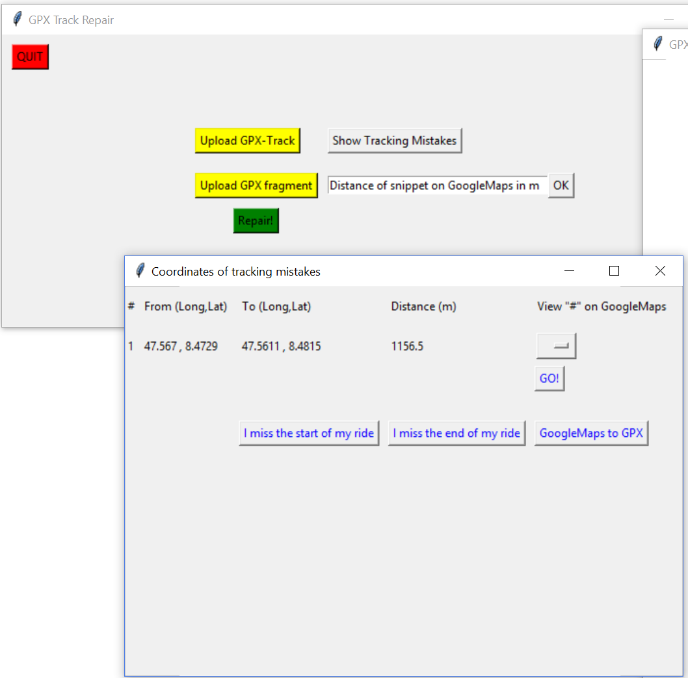
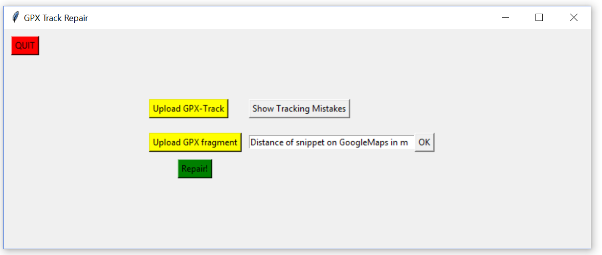
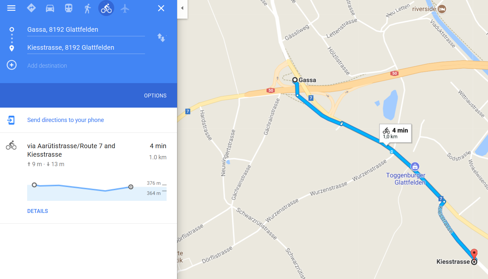
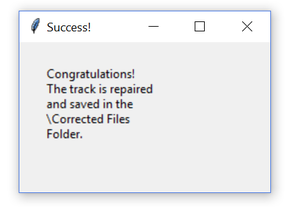

[](https://badge.fury.io/py/gpxfix)
[](https://opensource.org/licenses/MIT)
[](https://pepy.tech/project/gpxfix)
[](https://pepy.tech/project/gpxfix)
[](https://github.com/psf/black)

# gpxfix
A small python-based GUI that helps you reestablishing broken GPX-files.


## When can this be useful?
It's a common issue for every sportsman who loves recording activities. Your device runs out of battery before you come back home, you forgot to start the record when you left home or, even worse but a frequent problem in older iPhones, you lost GPS signal somewhere on the track for a couple of minutes. 
Then, checking out your track, you see straight lines or the first/last bit is completelty missing.

## Installation
Install from PyPI with `uv`:
```sh
uv tool install gpxfix
```

Or run from local source:
```sh
uv sync
uv run gpxfix
```

If you installed with `uv tool install`, you can run `gpxfix` directly. For local development, use `uv run gpxfix`.

If you see a Tcl/Tk error like `Can't find a usable init.tcl`, create the venv with system Python:
```sh
uv sync --python /usr/bin/python3
```


## Usage instructions
1. If you run the file, the default window of the GUI shows up:

2. Upload your GPX file via **Upload GPX-Track**.
3. You get a confirmation message once the file has been parsed successfully.
4. Press **Show Tracking Mistakes** to detect missing sections. By default, a tracking mistake is defined as no trackpoint for at least **5 sec** and at least **400m** movement.
5. In the mistakes window:
   - If no errors are found, you will see a message saying *"Great! No error has been found."*
   - If errors are found, select the hole number in the dropdown, click **Show details** to view coordinates/distance, or click **GO!** to open that hole on Google Maps.
   - Use **I miss the start of my ride** / **I miss the end of my ride** for missing start/end sections.
   - Use **GoogleMaps to GPX** to open [mapstogpx](https://www.mapstogpx.com).
   
6. Create and download your snippet GPX from mapstogpx (tick **Advanced Settings -> Include Elevation**) and note the snippet distance from Google Maps.
7. Upload the snippet via **Upload GPX fragment**.
8. Click **Enter Distance** and input the snippet distance in meters via the keypad dialog.
9. Click **Repair!** to merge and repair the track.
10. The repaired file is saved in the directory "*Corrected Files*".
    

11. If you have multiple issues with your GPX file, repeat the procedure.

Feel free to fork and please report any issues.
